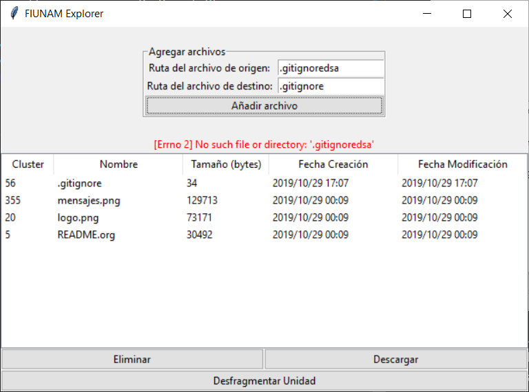

# Proyecto 3: (Micro) sistema de archivos

González Flores Andrés

## Requerimientos

- Python 3

## Descripción de la interfaz

Este proyecto está hecho con python 3, con una interfaz gráfica usando la librería tkinter.

Para correrlo es necesario tener en la misma carpeta un archivo de imagen de sistema llamado fiunamfs.img y ejecutar el comando `$ python FIUNAMFSExplorer.py` o `$ python3 FIUNAMFSExplorer.py`, dependiendo de cuál sea el nombre del ejecutable de python 3. Hacer esto nos mostrará una interfaz como la que sigue:

En ella se muestra una lista con los archivos del directorio con la información del cluster donde inician, su nombre, su tamaño en bytes, su fecha de creación y su fecha de modificación. También se  muestran botones para añadir, eliminar y descargar un archivo; así como un boton para desfragmentar la unidad. 

### Funciones

#### Copiar un archivo de nuestro sistema de archivos a FIUNAMFS

Para agregar un archivo es necesario ingresar el nombre y ruta completa o relativa del archivo de origen, el cuál se escribirá con el nombre puesto en el campo *Ruta de archivo de destino*.

En caso de existir un error, se mostrará el mensaje correspondiente a este (este programa no está hecho para aceptar duplicados, así que el ingresar otro archivo con el mismo nombre resultará en un error).

#### Eliminar un archivo.

Para eliminar un archivo basta con seleccionarlo haciendo clic en él y oprimir el botón correspondiente. Hacer esto nos mostrará un cuadro de diálogo pidiendo confirmación.

Al confirmar, muestra mensaje de éxito y elimina el archivo.

#### Copiar un archivo de FIUNAMFS a nuestro sistema de archivos

Para copiar un archivo a nuestro sistema de archivos, necesitamos seleccionar el archivo sobre el cuál queremos hacer esta operación y oprimir el botón de Descargar. Al hacer esto, se desplegará una ventana dónde tendremos que indicar la ruta y nombre del archivo por escribir.

Al confirmar la acción, la ventana principal nos muestra un mensaje de éxito y podemos comprobar que el archivo fue escrito en la ruta que le especificamos.

#### Desfragmentar la unidad

Para desfragmentar la unidad basta con presionar el botón de Desfragmentar Unidad. Esto unirá los clusters que no estén contiguos, hasta tener la unidad desgragmentada por completo.

Unidad antes de ser desfragmentada:

Unidad desgragmentada:

Aquí podemos notar que los clusters de inicio de los archivos blackburd5.jpg, blackbird7.jpg y mensaje0s.png fueron movidos.